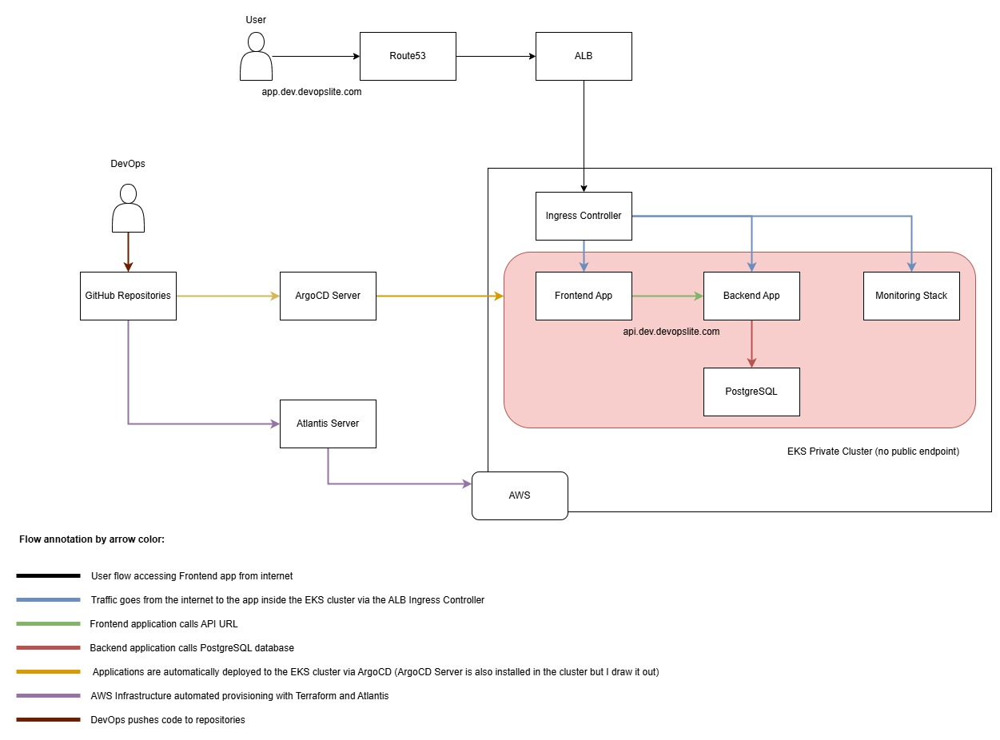
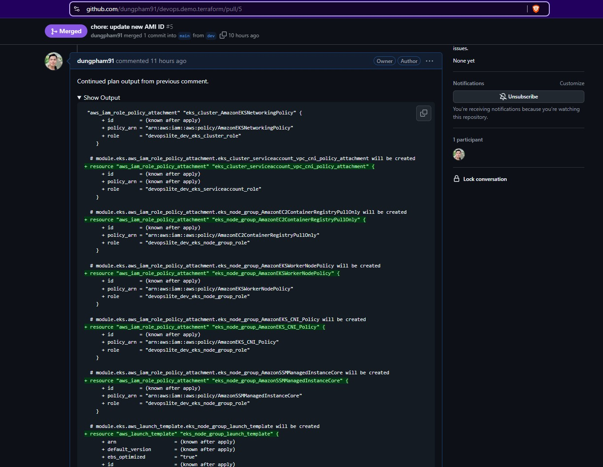

# The repository contains the Terraform code used to create the infrastructure for the demo DevOps flow

Hi,

This is a repository from a group of repositories that I used to do a demo of building a GitOps system combined with DevSecOps (basic).

Below is a list of all the repositories that I used.

| Repository | Purpose |
| ------ | ------ |
| https://github.com/dungpham91/devops.demo.docs | This is the repository that contains the documentation for this demo. I provide all the README files and images in this repository. You should read it and see how the code in the other repositories works. |
| https://github.com/dungpham91/devops.demo.argocd | This is the repository that holds the application's Helm charts and includes the ArgoCD app files used to register to the ArgoCD Server. All apps in this repository are set to automatically sync to the server, demonstrating the GitOps process. |
| https://github.com/dungpham91/devops.demo.frontend | This is a Frontend app repository that I created using Vue.js, it's very simple and I didn't CSS it much. The purpose is to simulate how a Frontend app calls a Backend API app. |
| https://github.com/dungpham91/devops.demo.backend | This is the Backend application repository that I wrote in Node.js using the Express library. And I also wrote it quite simply, just creating an API to get the current block information of the BTC token and save it to the PostgreSQL database. The Frontend application also only calls this 1 API. |
| https://github.com/dungpham91/devops.demo.terraform | This repository contains all the Terraform code I use to create infrastructure resources on AWS. I automate it with Atlantis. We implement GitOps for IaC as well. |
| https://github.com/dungpham91/devops.demo.ansible | This repository contains the Ansible code that I intend to use to install an ETH (with geth) or Erigon (with erigon-ckd) blockchain node. Because the hardware requirements of a blockchain node are very large and therefore very expensive, I have not fully implemented it in this demo. I will test the Ansible code when time and finances permit. |

